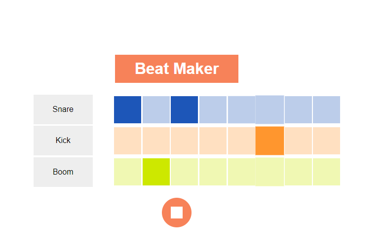

# HTML/CSS/SCSS/JS Beat Maker App

Changing color with CSS thanks to DOM.
Adding functionality with JavaScript.
Make styling easy with scss.

## How To Use ? 
After getting all the files. Open with live server

## İmages

